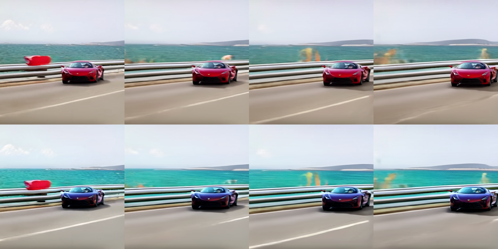
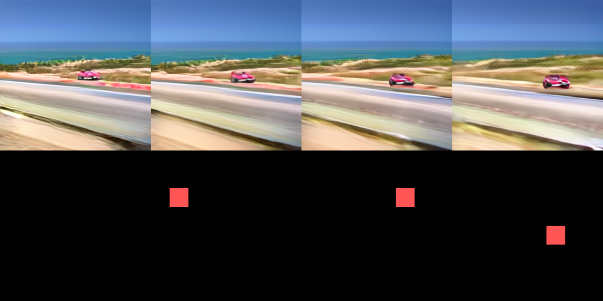
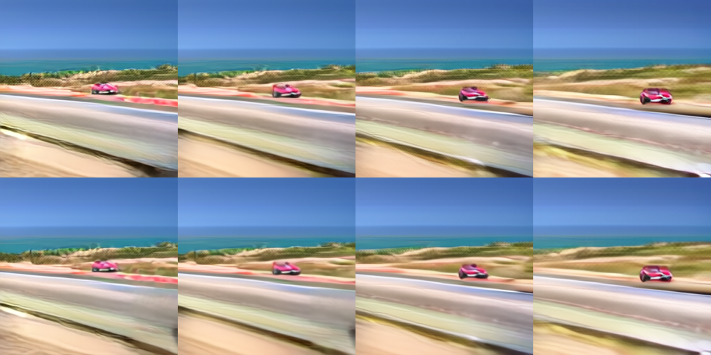
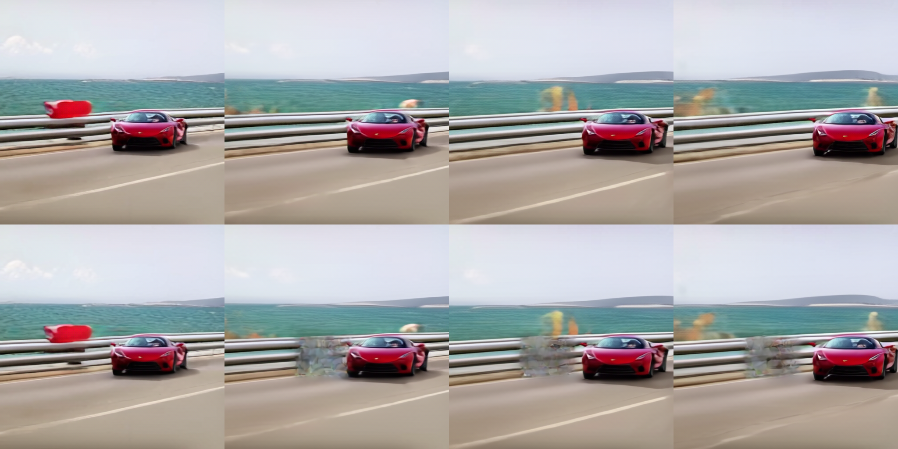
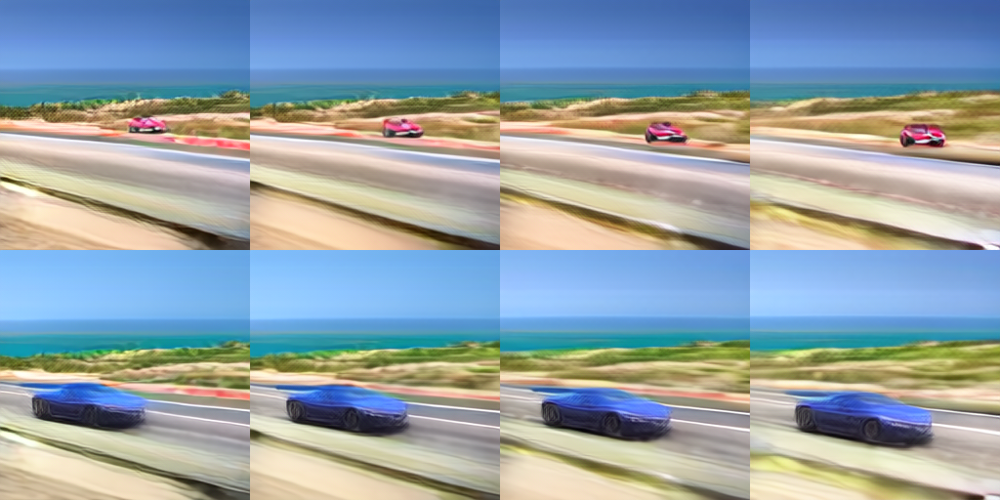

# SwiftEdit → LTX video editing (a study)

Adapting **[SwiftEdit](https://github.com/Qualcomm-AI-research/SwiftEdit)** (Qualcomm, CVPR'25 —
one-step, mask-free, text-guided *image* editing) to **LTX** *video*. The honest research trail:
what ported, what hit a wall and **why**, and the method that finally made a **clean training-free
video edit** work.

Everything ran on a single **RTX 3090 Ti (24 GB)**, on the small OOM-safe **LTX-Video-0.9.1 (2B)**,
bf16. Every result below peaks **≤ 6.6 GB VRAM** — no int8, no training.

**The test:** generate a source clip *"a red sports car driving on a coastal road"*, then edit it to
*"a blue sports car …"* — recolor the car, change nothing else.

---

## TL;DR

| Stage | Approach | Result |
|---|---|---|
| P0 | temporal VAE round-trip + RF-DiT engine | ✅ works (VAE 35.5 dB) |
| P0b | RF-ODE **inversion** (Heun) | ✅ 0.99 on smooth clips — but **0.35–0.62 on detailed frames** |
| P1 | prompt-diff **mask** | ✅ localizes on the car + tracks its motion |
| P2 | latent-blend edit (SDEdit) | ⚠️ background preserved, **car stays red** |
| P2b | **attention-level** edit (SwiftEdit `fwd_ip`) | ⚠️ background preserved, **car stays red** (even at 512²) |
| **FlowEdit** | **inversion-free** RF edit | ✅ **clean red→blue recolor** |

**The lesson:** SwiftEdit's *mechanism* (mask + region control) ports to video, but its training-free
*edit* is bottlenecked by **inversion fidelity** — inverting a detailed clip to noise is inaccurate,
and that error sinks the edit. **[FlowEdit](https://arxiv.org/abs/2412.08629)** never inverts, so it
never hits that wall.

---

## The result: FlowEdit works



*512², top = source (red), bottom = edit (blue). Same car shape/size/position, background preserved.
Training-free, inversion-free, mask-free. 29 s, 6.6 GB.* (`scripts/flowedit_ltx.py`)

FlowEdit ([Kulikov et al., 2025](https://arxiv.org/abs/2412.08629)) integrates, from the source
latent `x0`, the **difference** between the edit-prompt and source-prompt velocity fields:

```
V_Δ = v_θ(z_tgt, σ, c_edit) − v_θ(z_src, σ, c_src)
z_src = (1−σ)·x0 + σ·n      z_tgt = Z_fe + (z_src − x0)      Z_fe += Δσ · V_Δ
```

Where the two prompts agree, `V_Δ ≈ 0` → that region is frozen. Where they disagree (the car), the
edit accumulates. No inversion to noise, so the P0b inversion ceiling never applies.

Knobs (`FE_*` env vars): `FE_TGT_GS` is edit strength (**4–5 = clean recolor, 5.5+ morphs the car**),
`FE_SRC_GS ≈ 1.5`, `FE_NAVG` (variance reduction), `FE_NMIN/NMAX` (edit band), `FE_H/W/N`.

---

## The trail that led there

**P1 — the prompt-diff mask works.** `|inv(red) − inv(blue)|` lights up on the car and tracks it:



**P2 / P2b — the edit does NOT transfer training-free.** Both latent-blend and attention-level
control preserve the background beautifully but **cannot recolor** — the car stays red:



Even at 512² (more latent cells on the car), still red — so it isn't a resolution limit:



**Why (decisive diagnostic, `scripts/p2b_recon_diag.py`):** the RF-ODE inversion the edit relies on
round-trips at only **cos 0.52 (uncond) / 0.62 (cond)** on the detailed car frames — vs **0.99** on a
smooth synthetic clip. It's a *content-dependent inversion ceiling*, not a bug (the attention hook is
bit-identical to stock). That's what blocks the edit — and exactly what FlowEdit avoids.

**First FlowEdit hit (256², strong guidance):** the car turns blue but morphs bigger — dialing
`FE_TGT_GS` down and going to 512² gives the clean recolor above.



---

## Reproduce

```bash
pip install "diffusers>=0.38.0.dev0" transformers accelerate torch
# weights: Lightricks/LTX-Video-0.9.1  (transformer + vae; ~5.7 GB) and google/t5-v1_1-xxl (encoder)
python scripts/p1_encode.py        # T5-encode src/edit prompts -> p1_embeds.pt (once)
FE_H=512 FE_W=512 FE_TGT_GS=4.5 python scripts/flowedit_ltx.py   # the working edit
```

Phase scripts (`scripts/`): `p0_run` (engine), `p0b_invert` (RF-ODE inversion), `p1_encode`/`p1_mask`
(mask), `p2_edit`/`p2b_attn_edit` (the training-free edits that stall), `p2b_recon_diag` (the
diagnostic), **`flowedit_ltx`** (the working editor). Full derivation in `DESIGN.md` /
`DESIGN_P2b_attention.md`.

## Credits & licensing
- **SwiftEdit** — Qualcomm AI Research, CVPR 2025 (BSD-3-Clause-Clear). Not vendored here; this repo
  re-implements the adaptation and references the original.
- **FlowEdit** — Kulikov, Kligvasser, Manor, Michaeli, 2025 (arXiv:2412.08629).
- **LTX-Video** — Lightricks.

Research/study only.
